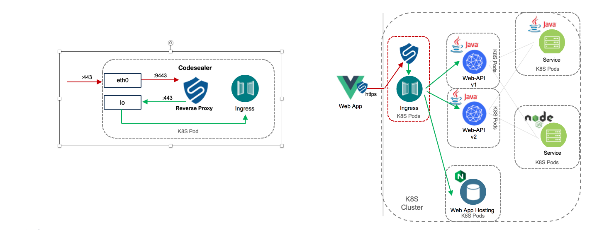

# Codesealer Helm Repository

This repository contains various [Helm](https://helm.sh) charts for installing
[Codesealer](https://codesealer.com) in [Kubernetes](https://kubernetes.io).

See the readme of each chart for more information:
* [Codesealer Ingress Sidecar Helm Chart](/charts/codesealer/README.md)

## Implementation

Codesealer, when implemented as a sidecar, uses an Admission Webhook to install Codesealer
in the same pod as an Ingress Controller.  

This diagram shows how the Admission Webhook comes into the picture.  Codesealer is implemented
as a `Mutating Admission` Webhook:

The `Mutating Admission` Webhook injects Codesealer as a sidecar:

Traffic originally destined for the Ingress Controller (Service) is `pre-routed` to Codesealer (Proxy)
and then passed back to the Ingress Controller (Service):

In this example the `Proxy` is Codesealer, a reverse proxy.  Traffic originally destinged for the `Service` 
(Ingress Controller ) over the ethernet eth0 interface is pre-routed to Codesealer for processing.  
Once Codesealer processes the payload it will send the traffic to the Ingress Controller over the loopback 
l0 interface on the original port.

There are two methods, similar to Istio, to pre-route the traffic:

1. A privileged Init Container that briefly runs in the same pod as the Ingress Controller [Kubernetes Init Containers](https://kubernetes.io/docs/concepts/workloads/pods/init-containers/)
2. Using a chained CNI Plugin which does not require the Ingress Controller to allow privilege escalation

Codesealer supports both methods

## Reference
1. https://kubernetes.io/docs/reference/access-authn-authz/extensible-admission-controllers/
