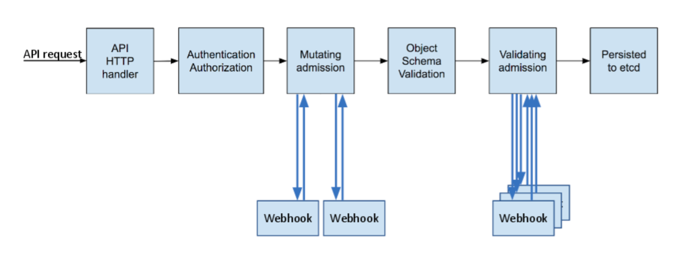

# Codesealer Helm Chart

1. [Introduction](#introduction)
   1. [Standalone Mode](#standalone-mode)
   1. [Sidecar Mode](#sidecar-mode)
1. [Prerequisites](#prerequisites)
1. [Installing](#installing)
   1. [Standalone Mode](#standalone-mode)
   1. [Sidecar Mode](#sidecar-mode)
1. [Upgrading](#upgrading)
1. [Uninstalling](#uninstalling)
1. [Additional Setup](#additional-setup)
   1. [Ingress](#ingress)
   1. [Target Application](#target-application)
1. [Kubernetes Implementation Specifics](#kubernetes-implementation-specifics)
   1. [kind + NGINX](#kind--nginx)
   1. [Minikube](#minikube)

## Introduction

This Helm chart allows you to install [Codesealer](https://codesealer.com) in two
different ways: as a standalone deployment or as a sidecar to an existing ingress.

If you need pointers on installing an ingress or a demo application to try out
Codesealer with, see the [Addtional Setup](#additional-setup) section. The [Kubernetes
Implementation Specifics](#kubernetes-implementation-specifics) section contains
additional instructions for running Codesealer in various Kubernetes implementations.

### Standalone Mode

Codesealer can be installed as a standalone proxy, independent of an existing
application deployment. The deployment architecture is show in the diagram below.


After deployment the Worker proxies can be configured through the Management Portal. The
protected application can reside in the same cluster as the Codesealer deployment, but
this is not a requirement for this deployment mode. This mode also allows Codesealer to
be horizontally scaled independently of the application and to protect several different
applications simultaneously.

### Sidecar Mode

Codesealer can be installed as a sidecar to an existing application using a Kubernetes
Ingress Controller. In this mode, Codesealer is injected into the same pod as the
Ingress Controller and through an iptables preroute, Codesealer intercepts the traffic
destined for the Ingress Controller and protects the code and APIs exposed by the
application.

Like an Istio Service Mesh, the Codesealer sidecar can be injected through the following
methods:

1. (default) An init container that briefly runs in the same pod as the Ingress
   Controller. This requires `NET_ADMIN` privilege.
2. Container Network Interface (`CNI`), which does not require elevated privileges. This
   can be enabled by setting `sidecar.initContainers.enabled=false` when installing the
   Helm Chart.

Codesealer's sidecar mode uses an Admission Webhook to install Codesealer in the same
pod as an Ingress Controller. This diagram shows how the Admission Webhook comes into
the picture. Codesealer is implemented as a `Mutating Admission` Webhook:



The `Mutating Admission` Webhook injects Codesealer as a sidecar. Traffic originally
destined for the Ingress Controller is prerouted to Codesealer and then passed back to
the Ingress Controller. This approach requires no changes to the application other than
providing Codesealer with the ingress certificates.


In this example the `Reverse Proxy` is Codesealer.  Traffic originally destined for the
`Ingress Controller` over the ethernet `eth0` interface is prerouted to Codesealer for
processing. Once Codesealer processes the payload it will send the traffic to the
Ingress Controller over the loopback `lo` interface on the original port.

Codesealer support multiple Ingress Controllers including NGINX Ingress, Contour, Istio
Gateway, Kubernetes Gateway, and Cloud Provider Ingress Controllers (e.g. AWS ALB).

Although this example uses an Ingress Controller for the injection, Codesealer can be
injected into any pod to protect any service. It functions similar to an Istio Service
Mesh which uses an Envoy Proxy instead.

## Prerequisites

To use this helm chart you will need an access token for the Codesealer Docker registry,
a Codesealer cluster key, and a URL for the Codesealer Control Plane. All of these can
be obtained by creating a Cluster in the Codesealer Portal. In the following we assume
that these values are set as follows:

```bash
export CODESEALER_TOKEN="<Docker access token>"
export CLUSTER_KEY="<Cluster key>"
export CONTROL_URL="<Control Plane URL"
```

If you are installing Codesealer in sidecar mode, you will additionally need to set some variables related to your ingress:

```bash
export INGRESS_NAMESPACE="<Namespace of your ingress>"
export INGRESS_DEPLOYMENT="<Name of your ingress deployment>"
export INGRESS_PORT="<Port used by your ingress>"
```

If you need pointers on installing an ingress or a demo application to try out
Codesealer with, see the [Addtional Setup](#additional-setup) section.

## Installing

To use this chart, first add the Codesealer Helm repository:

```bash
helm repo add codesealer https://code-sealer.github.io/helm-charts
```

To view documentation for all the Chart's values, run:

```bash
helm show values codesealer/codesealer
```

### Standalone Mode

To install Codesealer in standalone mode, run the following command:

```bash
helm install codesealer codesealer/codesealer \
  --create-namespace --namespace codesealer \
  --set codesealerToken="$CODESEALER_TOKEN" \
  --set worker.clusterKey="$CLUSTER_KEY" \
  --set worker.controlURL="$CONTROL_URL"
```

After deployment, Codesealer's Management Portal can be accessed through port forward:

```bash
kubectl port-forward service/core-manager -n codesealer-system 8444:8444
```

### Sidecar Mode

To install Codesealer in sidecar mode, run the following command:

```bash
helm install codesealer codesealer/codesealer --create-namespace --namespace codesealer \
  --set codesealerToken="$CODESEALER_TOKEN" \
  --set worker.clusterKey="$CLUSTER_KEY" \
  --set worker.controlURL="$CONTROL_URL" \
  --set sidecar.enabled=true \
  --set sidecar.ingress.namespace="$INGRESS_NAMESPACE" \
  --set sidecar.ingress.deployment="$INGRESS_DEPLOYMENT" \
  --set sidecar.ingress.port="$INGRESS_PORT" \
  --set-literal manager.init='{"Organizations":{"55934bea-afc8-11ee-8578-2ec2e82b2333":{"Name":"Demo Organization","BackendID":"default","Endpoints":{"b7918ded-eae6-4a75-b6da-e44d59d1408a":{"remoteIn":"https://localhost","remoteOut":"https://127.0.0.1","allowedDomains":["*"],"scriptOptOut":true,"autoXhr":true,"enableWaf":true,"wafFullTransaction":true,"protectDynamicContent":true}},"AllowedDomains":["localhost"]}}}'
```

To inject the sidecar into your ingress, label and patch your ingress deployment as
follows:

```bash
kubectl label ns ingress-nginx codesealer.com/webhook=enabled
kubectl patch deployment ingress-nginx-controller \
  -n ingress-nginx \
  -p '{"spec": {"template":{"metadata":{"annotations":{"codesealer.com/injection":"enabled"}}}} }'
```

The ingress controller should restart with an additional Codesealer container. If you
need to modify the default configuration of the Worker, Codesealer's Management Portal
can be accessed through port forward:

```bash
kubectl port-forward service/core-manager -n codesealer-system 8444:8444
```

## Upgrading

To update an existing deployment, make sure to first update the repository:

```bash
helm repo update codesealer
```

To upgrade the deployment using the same values, run the following command:

```bash
helm upgrade --reuse-values --namespace codesealer codesealer codeealer/codesealer
```

If you want to specify new values, replace the `--reuse-values` flag with the
appropriate `--set` flags.

## Uninstalling

To uninstall a Codesealer deployment, run the following commands:

```bash
helm uninstall codesealer --namespace codesealer
helm repo remove codesealer
```

## Additional Setup

### Ingress

In sidecar mode, Codesealer injects itself into an existing Ingress. The following
Kubernetes Ingress Controllers are supported:
1. [Minikube Ingress Addon](https://kubernetes.io/docs/tasks/access-application-cluster/ingress-minikube/)
2. [NGINX Ingress Controller](https://docs.nginx.com/nginx-ingress-controller/)
3. [Contour Ingress Controller](https://projectcontour.io/docs/v1.10.0/)
4. [Istio Ingress Gateway](https://istio.io/latest/docs/tasks/traffic-management/ingress/ingress-control/)
5. Public Cloud Ingress Controllers

If you don't have an ingress already, you can install an [NGINX Ingress Controller](https://github.com/kubernetes/ingress-nginx/tree/main/charts/ingress-nginx)
using the following command:

```bash
helm repo add ingress-nginx https://kubernetes.github.io/ingress-nginx
helm install ingress-nginx ingress-nginx/ingress-nginx \
  --namespace ingress-nginx --create-namespace \
  --wait --timeout=60s
```

### Target Application

Codesealer will add protection to any existing web application. If you don't already
have an application, you can install [OWASP's Juice
Shop](https://owasp.org/www-project-juice-shop/) demo application using the following
command:

```bash
helm repo add securecodebox https://charts.securecodebox.io/
helm install juice-shop securecodebox/juice-shop --namespace juice-shop --create-namespace \
  --set ingress.enabled=true \
  --set "ingress.hosts[0].host=localhost,ingress.hosts[0].paths[0].path=/" \
  --set "ingress.tls[0].hosts[0]=localhost,ingress.tls[0].secretName=" \
  --set ingress.pathType=Prefix \
  --wait --timeout=60s
```

## Kubernetes Implementation Specifics

### kind + NGINX

To run this chart in sidecar mode with [kind](https://kind.sigs.k8s.io/) and the [NGINX
Ingress Controller](https://docs.nginx.com/nginx-ingress-controller/), use the following
Kind configuration:

```yaml
kind: Cluster
apiVersion: kind.x-k8s.io/v1alpha4
nodes:
- role: control-plane
  kubeadmConfigPatches:
  - |
    kind: InitConfiguration
    nodeRegistration:
      kubeletExtraArgs:
        node-labels: "ingress-ready=true"
  extraPortMappings:
  - containerPort: 80
    hostPort: 80
    protocol: TCP
  - containerPort: 443
    hostPort: 443
    protocol: TCP
```

And deploy NGINX using the `hostPort` and `NodePort` options:
```bash
helm install ingress-nginx ingress-nginx/ingress-nginx \
  --namespace ingress-nginx --create-namespace \
  --set controller.hostPort.enabled=true \
  --set controller.service.type=NodePort \
  --set controller.updateStrategy.rollingUpdate.maxUnavailable=1 \
  --wait --timeout=90s
```

### Minikube

To run this chart in sidecar mode with [Minikube](https://minikube.sigs.k8s.io/docs/),
the easiest way to deploy an ingress is to use the Ingress addon:

```bash
minikube addons enable ingress
minikube tunnel
```
